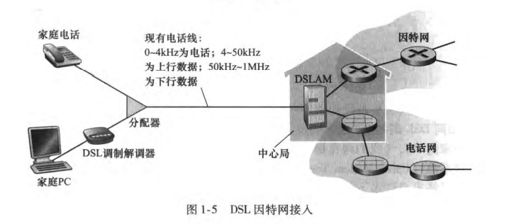

# 计算机网络：自顶而下方法

[TOC]

## 第一章：计算机网络和因特网

### 1.1 什么是因特网

#### 1.1.1 具体构成描述

主机host或者端系统end system

端系统通过通信链路（communication link）和分组交换机（packet switch）连接在一起，不同链路有不同的传输速率，单位是bps；传输时信息分段成packet；分组交换机最著名的是路由器（router）和链路层交换机（link-layer switch）

端系统通过因特网服务提供商（Internet Service Provider，ISP）接入因特网，每个ISP本身就是多个分组交换机和多段通信链路组成的网络

端系统、分组交换机和其他因特网部件都要运行一系列协议Protocol

因特网标准Internet Standard由因特网工程任务组Internet Engineering Task Force，IETF研发，IETF的标准文档称为请求文档Request For Comment，RFC

#### 1.1.2 服务描述

分布式应用程序

通过套接字接口socket interface来向其他端系统发送信息

### 1.2 网络边缘

主机划分成为客户端和服务器

#### 1.2.1 接入网

指将端系统物理连接到其边缘路由器的网络。边缘路由器端系统到任何远程端系统的路径上的第一台路由器。

1. 家庭接入：DSL、电缆、FTTH、拨号和卫星

   数字用户线 Digital Subscriber Line，网络连接和电话同一根线

   

   电缆利用有线电视公司现有的有线电视基础设施，电缆上同时使用下行网络将变慢

   

   FTTH（Fiber To The Home）光纤到户。直接光纤给每户设置一根光纤，更常见的是共享一根，分为主动光纤网络（Active Optical Network，AON）和被动光纤网络（Passive Optical Network，PON）。前者本质上是交换因特网

   

2. 企业或家庭接入：以太网和WiFi

   

3. 广域无线接入：3G和LTE

#### 1.2.2 物理媒体

- 导引型媒体
  - 固体：光缆、双绞铜线
- 非导引型媒体
  - 无线局域网等

### 1.3 网络核心

#### 1.3 分组交换

分组交换机使用**存储转发传输** (store-and-forward transmission) 机制，表示开始输出packet的之前须接受到整个分组

端到端时延$d_{端到端}=N\frac{L}{R}$，其中$N$是几条链路，$L$是数据量，$R$是速率

每台分组交换机有多条链路与之相连，存在一个**输出缓存**，也称**输出队列**，分组有**排队时延**，如果缓存空间满了，还会出现**分组丢失（丢包）**的现象

路由器采用**转发表**forwarding table来转发，采用**路由选择协议**自动设置转发表

除了分组交换（如因特网），还有**电路交换**（如电话网络），当要通信的时候会建立一条专用的**端到端连接**

#### 1.4 分组网络中的时延、丢包和吞吐量

节点总时延=节点处理时延+排队时延+传输时延+传播时延

传输时延是路由器推出packet所需要的时间

传播时延是一台路由器到了一台路由器所需要的时间

排队时延最复杂：

- 流量强度：$La/R$，$L$是packet大小，单位是bit，$a$是达到队列的平均速率（pkt/s），$R$是传输速率，单位是bit
- 当流量强度大于1的时候，队列无限增加，故必须控制在1以下

瞬时吞吐量是某主机接收文件的速率

平均吞吐量

瓶颈链路：链路上的速率不同，传输速度是最小值

