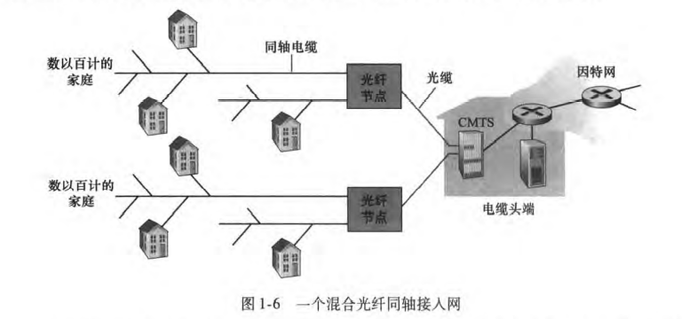
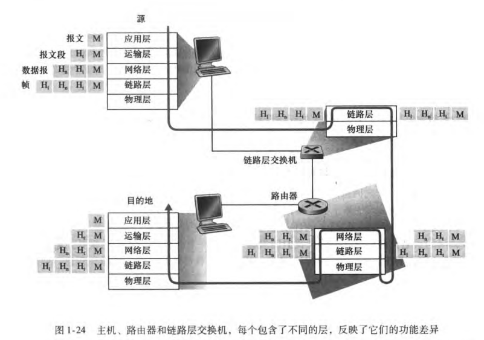
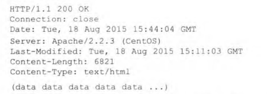
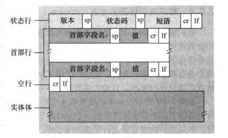
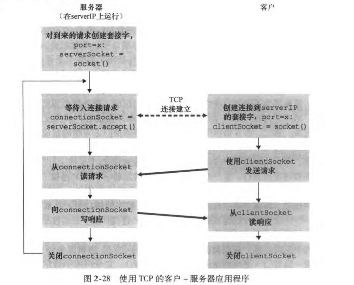

# 计算机网络：自顶而下方法

[TOC]

## 第一章：计算机网络和因特网

### 1.1 什么是因特网

#### 1.1.1 具体构成描述

主机host或者端系统end system

端系统通过通信链路（communication link）和分组交换机（packet switch）连接在一起，不同链路有不同的传输速率，单位是bps；传输时信息分段成packet；分组交换机最著名的是路由器（router）和链路层交换机（link-layer switch）

端系统通过因特网服务提供商（Internet Service Provider，ISP）接入因特网，每个ISP本身就是多个分组交换机和多段通信链路组成的网络

端系统、分组交换机和其他因特网部件都要运行一系列协议Protocol

因特网标准Internet Standard由因特网工程任务组Internet Engineering Task Force，IETF研发，IETF的标准文档称为请求文档Request For Comment，RFC

#### 1.1.2 服务描述

分布式应用程序

通过套接字接口socket interface来向其他端系统发送信息

### 1.2 网络边缘

主机划分成为客户端和服务器

#### 1.2.1 接入网

指将端系统物理连接到其边缘路由器的网络。边缘路由器端系统到任何远程端系统的路径上的第一台路由器。

1. 家庭接入：DSL、电缆、FTTH、拨号和卫星

   数字用户线 Digital Subscriber Line，网络连接和电话同一根线

   

   电缆利用有线电视公司现有的有线电视基础设施，电缆上同时使用下行网络将变慢

   

   FTTH（Fiber To The Home）光纤到户。直接光纤给每户设置一根光纤，更常见的是共享一根，分为主动光纤网络（Active Optical Network，AON）和被动光纤网络（Passive Optical Network，PON）。前者本质上是交换因特网

   

2. 企业或家庭接入：以太网和WiFi

   

3. 广域无线接入：3G和LTE

#### 1.2.2 物理媒体

- 导引型媒体
  - 固体：光缆、双绞铜线
- 非导引型媒体
  - 无线局域网等

### 1.3 网络核心

#### 1.3 分组交换

分组交换机使用**存储转发传输** (store-and-forward transmission) 机制，表示开始输出packet的之前须接受到整个分组

端到端时延$d_{端到端}=N\frac{L}{R}$，其中$N$是几条链路，$L$是数据量，$R$是速率

每台分组交换机有多条链路与之相连，存在一个**输出缓存**，也称**输出队列**，分组有**排队时延**，如果缓存空间满了，还会出现**分组丢失（丢包）**的现象

路由器采用**转发表**forwarding table来转发，采用**路由选择协议**自动设置转发表

除了分组交换（如因特网），还有**电路交换**（如电话网络），当要通信的时候会建立一条专用的**端到端连接**

#### 1.4 分组网络中的时延、丢包和吞吐量

节点总时延=节点处理时延+排队时延+传输时延+传播时延

传输时延是路由器推出packet所需要的时间

传播时延是一台路由器到了一台路由器所需要的时间

排队时延最复杂：

- 流量强度：$La/R$，$L$是packet大小，单位是bit，$a$是达到队列的平均速率（pkt/s），$R$是传输速率，单位是bit
- 当流量强度大于1的时候，队列无限增加，故必须控制在1以下

瞬时吞吐量是某主机接收文件的速率

平均吞吐量

瓶颈链路：链路上的速率不同，传输速度是最小值

#### 1.5 协议层次及其服务模型

1. 协议分层

   1. 应用层

      如HTTP、SMTP和FTP，借助特定的应用层协议如DNS完成

      应用层信息分组称为报文message

   2. 运输层

      TCP和UDP，TCP将长报文划分成短报文并提供拥塞控制机制，当网络拥塞的时候源抑制其传输速度，UDP提供无连接服务，此层分组称为报文段segment

   3. 网络层

      此层分组为数据报datagram，协议是IP

   4. 链路层

      此层分组称为帧frame，例子包括以太网、WiFi和电缆接入网的DOCSIS协议

   5. 物理层

      物理层将帧中的一个个比特从一个节点移到下一个节点，与实际传输媒体相关，如双绞铜线、同轴光缆、光纤

2. OSI模型

3. 封装

   

## 第二章：应用层

### 2.1 应用层协议原理

应用体系结构：

- 客户-服务器体系结构
- P2P体系结构

进程通过套接字socket的软件接口向网络发送报文和从网络接受报文，socket也被称为应用程序和网络之间的应用程序编程接口，对运输层基本没有控制权（仅能选择运输层协议、设定几个参数）

运输服务的分类：

- 可靠数据传输，不需要可靠数据传输的应用称为容忍丢失的应用
- 吞吐量，具有吞吐量要求的应用称为带宽敏感的应用，否则称为弹性应用
- 定时
- 安全性

TCP服务：

- 面向连接的服务：在应用层数据报文开始流动之前，TCP让客户和服务器交换运输层控制信息，然后TCP连接在两个进程之间建立了，这条连接是全双工的
- 可靠的数据传送服务

（TCP和UDP都没有加密机制，目前TCP安全加强版SSL（Secure Socket Layer），这种强化是应用层的优化）

UDP服务：

- 无连接，不握手

### 2.2 Web和HTTP

#### 2.2.1 HTTP概述

Web应用层协议是HTTP。Web页面是由对象组成的，一个对象是一个文件且可以通过URL寻址，多数Web页面包含一个HTML基本文件和几个引用对象。

URL地址包括：存放对象的服务器主机名和对象的路径名

HTTP是一个无状态协议，它不保存任何关于客户的信息

#### 2.2.2 持续连接与非持续连接

- 后者每一个请求/响应对是经过一个单独的TCP连接发送的
  - 缺点：为每个请求对象建立和维护一个全新的连接，每一个对象经受2RTT的时延
- 前者是经相同的TCP连接发送的

TCP的三次握手：RTT表示Round-Trip Time指一个短分组从客户到服务器再到客户花费的时间

#### 2.2.3 HTTP报文的格式

请求报文：

第一行是请求行request line，其后是首部行header line

请求行有3个字段：方法字段、URL字段和HTTP版本字段

`Host`是Web代理高速缓存所要求的

`Connection: close`告诉服务器不要使用持续连接，发送完即可关闭连接

`User-agent`指明用户代理，服务器可以为不同类型的用户代理发送相同对象的不同版本

其中实体体entity body是POST方法使用的，Web页面的特定内容依赖于用户的输入

响应报文：

初始行、首部行、实体体

#### 2.2.4 用户与服务器的交互：cookie

- 在HTTP响应报文中的一个cookie首部行 `Set cookie: <cookie id>`
- 在HTTP请求报文中的一个cookie首部行 `Cookie: <cookie id>`
- 在用户端系统中保留有一个coolie文件，并由用户的浏览器进行管理
- 位于Web站点的一个后端数据库

#### 2.2.5 Web缓存（代理服务器）

代理服务器先自己查找是否有客户请求的内容，如果存在就直接返回客户，否则打开和原始服务器的连接然后存储在本地，然后返回给用户

内容分发网络Content Distribution Network, CDN公司安装大量分散的缓存器使得流量本地化

#### 2.2.6 条件GET方法

代理服务器里的内容可能是旧的，引入条件GET方法，在请求报文中加一个`If-Modified-Since`。

代理服务器发送给初始服务器条件GET方法来更新数据，Web服务器返回响应报文

### 2.3 因特网中的电子邮件

#### 2.3.1 SMTP

SMTP限制所有的邮件报文的体部分只能采用ASCII表示

SMTP不使用中间邮件服务器，端口是25，尝试连接`telnet serverName 25`，下面是SMTP握手协议的例子：（S表示Server，C表示Client）

HTTP是拉协议（获取信息），SMTP是推协议（将信息发送出去）

SMTP典型报文如下：

#### 2.3.4 邮件访问协议

注意上图的发送逻辑：Alice通过代理SMTP发送邮件到邮件服务器上，Alice的邮件服务器用SMTP连接到Bob的邮件服务器上，如对方的邮件服务器关机，就会每30min发送一次报文直到对方的邮件服务器变得可以运行为止。此时Bob**不能**用SMTP获得报文，他应该使用第三版的邮局协议Post Office Protocol-Version 3, POP3 / Internet Mail Access Protocol, IMAP以及HTTP

POP3：

- 三个阶段：特许、事务处理以及更新
- 端口：110
- 特许：用户代理发送明文用户名和口令以鉴别用户
  - 两个主要命令：`user <user name>`和`pass <password>`
  - 
  - 正确返回`+OK`，错误返回`-ERR`
- 事务处理：用户代理取回报文，同时用户代理还能对报文做删除标记、取消删除标记以及获取统计信息
  - 可以发送`list/retr/dele`命令
  - 
- 更新：用户发出quit之后结束POP3会话并删除被标记删除的报文

IMAP：

- 

基于Web的电子邮件：

Alice用浏览器发送以及Bob用浏览器接收的时候采用HTTP，中间服务器之间的收发是SMTP

### 2.4 DNS：因特网的目录服务

#### 2.4.1 DNS提供的服务

域名系统Domain Name System, DNS：主机名到IP地址转换的目录服务

DNS：

- 一个由分层的DNS服务器实现的分布式数据库
- 一个使得主机能够查询分布式数据库的应用层协议

- 运行在UDP之上，使用53号端口

解析IP的过程：

- 同一台用户主机上运行着DNS应用的客户端
- 浏览器从URL中抽取主机名，并将这个主机名传给DNS应用的客户端
- DNS客户向DNS服务器发送一个包含主机名的请求
- DNS最终收到一份回答报文，其中含有该主机名的IP地址
- 一旦浏览器接受到来自DNS的该IP地址，它能够向该IP地址80端口的HTTP服务器进程发起一个TCP连接

DNS的其他功能：

- 主机别名、规范主机名
- 邮件服务器别名
- 负载分配

#### 2.4.2 DNS工作机理概述

1. 分布式、层次数据库

   DNS服务器类型：根服务器、顶级域DNS服务器（TLD）和权威DNS服务器。用户先联系根，根返回顶级域名的IP地址（如com），然后用户联系TLD服务器，返回权威服务器的IP地址（如facebook.com）

   

   另外还有本地DNS服务器，先向本地DNS服务器发送请求，然后它转发给根等层级，最后返回给用户（类似代理）

2. DNS缓存

   本地DNS服务器会缓存主机名/IP地址对，DNS服务器在一段时间（通常设置为2天）将丢弃缓存的信息

#### 2.4.3 DNS记录和报文

所有DNS服务器存储了资源记录Resource Record,RR，其中提供主机名到IP地址的映射

RR是一个四元组`(Name, Value, Type, TTL)`

`TTL`是该记录的生存时间，决定资源记录

如果一台DNS是权威服务器，那么就会包含一条A记录

如果不是一台权威服务器，那么就会包含一条NS和一条A

报文：

向DNS数据库中插入记录：

在注册登记机构注册域名，注册机构将一个类型NS和一个类型A的记录输入TLD com服务器

### 2.5 P2P文件分发

当用户加入torrent的时候，它向tracker周期性注册表明仍然在torrent中，然后tracker随机从参与对等方的集合中选择对等方的一个子集IP地址发给用户。用户与这些其他用户尝试建立TCP连接，成功创建的称为“邻近对等方”。用户周期性地询问每个邻近对等方他们所具有的块（chunk，256KB）列表，然后对它没有的块发出请求

请求：用户采用**最稀缺优先**技术，首先申请最稀缺的块

发送：选择当前能够以最高速率向她提供数据的邻居，给出其优先权

### 2.6 视频流和内容分发网

#### 2.6.2 HTTP流和DASH

看视频时，用户和服务器建立TCP连接并发送GET请求，流式视频应用程序周期性地从用户应用程序缓存中抓取帧并对这些帧压缩并在用户屏幕上展现

对于不同用户以及相同用户的不同时间，用户带宽不同，所以产生**经HTTP的动态适应性流**（Dynamic Adaptive Streaming over HTTP, DASH）。视频编码成不同版本，用户动态请求来自不同版本且长度为几秒的视频段数据块

HTTP服务器有个Manifest File来提供每个版本的URL和比特率

#### 2.6.3 内容分发网CDN

视频流公司在CDN服务器中存储副本

1. CDN操作

   CDN必须根据URL找到适合客户的CDN服务器集群并将请求重定向到该集群的某台服务器上。大多数CDN使用DNS来截取并重定向。

   

   权威服务器会重定向给本地DNS服务器返回一个CDN的权威服务器

2. 集群选择策略

   地理上最为邻近策略，但是有的时候不是最近，而且永远固定。最好CDN实时测量时延和丢包性能

### 2.7 套接字编程：生成网络应用

#### 2.7.1 UDP套接字编程

#### 2.7.2 TCP套接字编程

