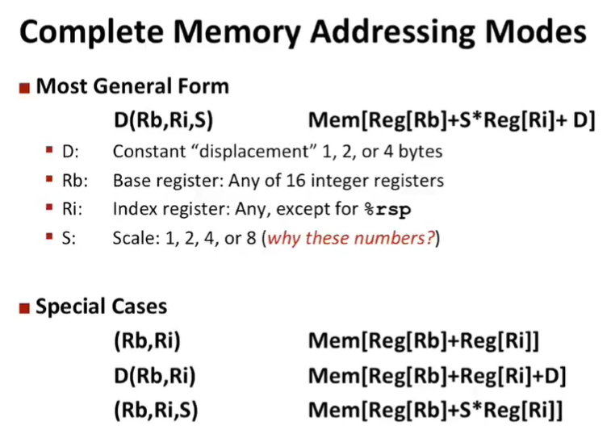
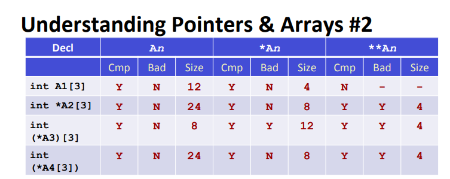

# CSAPP

[TOC]

## Bits, Bytes, and Integer

补码：最高位取负值，其他取正相加

最高位为1的二进制串，无符号和有符号相差$2^n$

有符号和无符号处理成两个无符号

安全的loop：

```cpp
unsigned i; // size_t better
for (i = cnt - 2; i < cnt; i--)
    	a[i] += a[i+1];
```

小端序：第一个字节是最低有效位（与视觉倒序）

字符串的存储不管大小端序

```pseudocode
# x, y is signed int; ux, uy is unsigned int

x < 0 -> x * 2 < 0 # false, x = 100...0
ux >= 0 # true
x & 7 == 7 -> (x << 30) < 0 # true
ux > -1 # always false
x > y -> -x < -y # false, y = TMin, x is any number
x * x >= 0 # false
x > 0 && y > 0 -> x + y > 0 # false
x >= 0 -> -x <= 0 # true
(x | -x) >> 31 == -1 # false, x = 0
```

## Floating Point

当exp为0的时候表示非规格化数，即0为前导数，**E=1-Bias** (Bias即127，$2^{k-1}-1$)

规格化数：Exp-Bias

非规格化数到规格化数平滑过渡


默认舍入方法：向偶数舍入（4舍6入5凑偶）


```cpp
int x;
float f;
double d;

x == (int)(float)x; // false
x == (int)(double)x; // true
f == (float)(double)f; // true
d == (double)(float)d; // false
f == -(-f); // true
2/3 == 2/3.0; // false
d < 0.0 -> (d*2) < 0.0 // true
d > f -> -f > -d // true
d * d >= 0.0 // true
(d + f) - d == f // false
```

## Machine-Level Programming

### Basics&Data

`-Og`表示对生成代码进行可读性的优化，`-S`表示stop暂停在汇编代码

反汇编`objdump -d a.out`

gdb中的反汇编`disassemble a.out`

x86寄存器（r开头为64位，e开头为32位）：


一个字2byte，长字4byte，四字8bytes (64bit)




32位计算的结果会将剩下的32位置为0，而8位计算结果不会将剩下的7个字节置为0

conditional move：同时计算then和else来加快流水线速度，只有在两个语句都比较简单的时候才会使用

switch建表：第一个case不为0的时候会加上bias成为0；如果case相差很大会变成if-else，使用二分搜索

### Procedures

ABI: Application Binary Interface

`rep`和`ret`是相同的意思

`call`的时候将`rsp`先减8然后将下一条指令的地址送入stack，最后`rip`放入下一条指令的地址

栈帧stack frame，有两个指针，一个是`rbp`基指针（optional），另一个是`rsp`，当分配的是一段可变长空间的时候会用到`rbp`

### Data

数组下标索引 `movl (%rdi, %rsi, 4), %eax`



注意上面A4中方括号的等级高于*，实际上和A2相同

当方括号没有数字相当于指针


### Advanced Topics

64位使用47位即256TB，0x00007FFFFFFFFFFF

stack一般为8MB，可以通过`limit`命令来查看

内存由低到高：Text/Data/Heap/Shared Libraries/Stack

malloc申请小内存的时候在低地址，大内存在高地址

栈上开空间有时候会预留一段buffer，当你填满buffer之后再写入就会修改return address，此时可能会SEGV也可能正常或非正常运行

防止栈溢出：1. 使用`fgets(buf, 4, stdin)/strncpy/%Ns`; 2. 栈随机化ASLR(Address Space Layout Randomization) ，text和data段数据位置没变，而stack、heap会变；3. 标记堆栈上位置权限（RWX）；4. Canary金丝雀，从fs寄存器中取8字节值放到buffer中。

## Program Optimization

### Generally Useful Optimizations

- Code Motion

  将一段被重复计算的代码放到前面计算一次

- 用左右移和加法来替代乘法和除法

- share common subexpressions（写成不一样的时候编译器不会优化）

  共用相同的表达式

- removing aliasing（编译器不会优化）

  当计算`b[i] = sum(a[n*i+j])`的时候编译器会每次取`b[i]`然后加上一个值再写进去，因为两个指针的地址可能有重合部分，可以用一个局部变量`val`来存循环求后者的和。

### Exploiting Instruction-Level Parallelism

- 循环展开

- Reassociated Computation

  改变括号，得到不一样的计算结构，但是对于float和double不一定得到相同答案

  

- Multiple Accumulator

  分别计算所有奇数和以及偶数和

  

- SIMD Operations

- 对于branch来说，会有寄存器副本，当运行错误的分支之后会取消所有副本的更新
