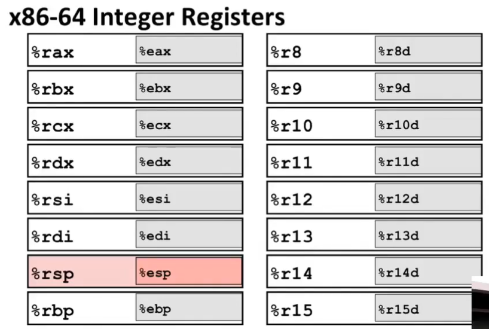
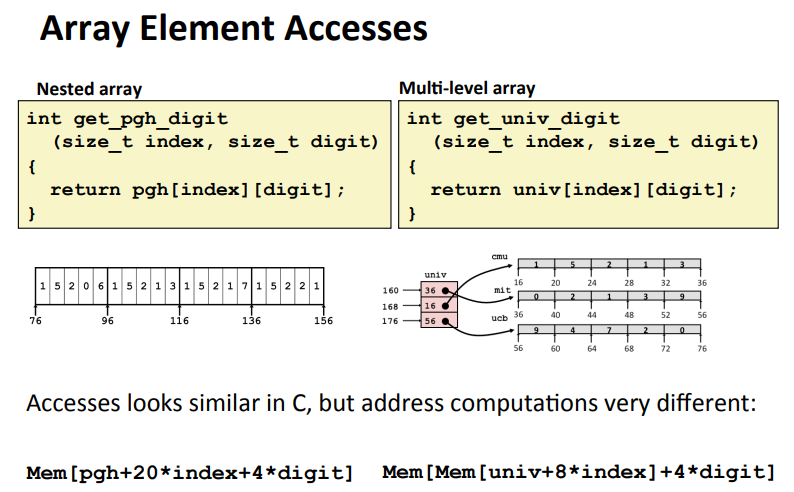
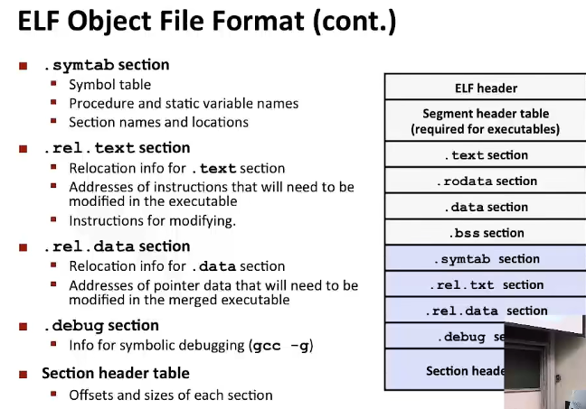
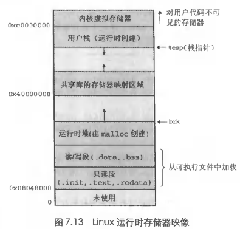

# CSAPP

[TOC]

## Bits, Bytes, and Integer

补码：最高位权重取负值，其他权重取正相加

最高位为1的二进制串，无符号和有符号相差$2^n$

有符号和无符号处理成两个无符号

安全的loop：

```cpp
unsigned i; // size_t better
for (i = cnt - 2; i < cnt; i--)
    	a[i] += a[i+1];
```

小端序：第一个字节是最低有效位（与视觉倒序）

字符串的存储不管大小端序

```pseudocode
# x, y is signed int; ux, uy is unsigned int

x < 0 -> x * 2 < 0 # false, x = 100...0
ux >= 0 # true
x & 7 == 7 -> (x << 30) < 0 # true
ux > -1 # always false
x > y -> -x < -y # false, y = TMin, x is any number
x * x >= 0 # false
x > 0 && y > 0 -> x + y > 0 # false
x >= 0 -> -x <= 0 # true
(x | -x) >> 31 == -1 # false, x = 0
```

## Floating Point

当exp为0的时候表示非规格化数，即0为前导数，**E=1-Bias** (Bias即127，$2^{k-1}-1$)

规格化数：Exp-Bias

非规格化数到规格化数平滑过渡


默认舍入方法：向偶数舍入（4舍6入5凑偶）


```cpp
int x;
float f;
double d;

x == (int)(float)x; // false
x == (int)(double)x; // true
f == (float)(double)f; // true
d == (double)(float)d; // false
f == -(-f); // true
2/3 == 2/3.0; // false
d < 0.0 -> (d*2) < 0.0 // true
d > f -> -f > -d // true
d * d >= 0.0 // true
(d + f) - d == f // false
```

## Machine-Level Programming

### Basics&Data

`-Og`表示对生成代码进行可读性的优化，`-S`表示stop暂停在汇编代码

反汇编`objdump -d a.out`

gdb中的反汇编`disassemble a.out`

x86寄存器（r开头为64位，e开头为32位）：



一个字2byte，长字4byte，四字8bytes (64bit)


32位计算的结果会将剩下的32位置为0，而8位计算结果不会将剩下的7个字节置为0

conditional move：同时计算then和else来加快流水线速度，只有在两个语句都比较简单的时候才会使用

switch建表：第一个case不为0的时候会加上bias成为0；如果case相差很大会变成if-else，使用二分搜索

### Procedures

ABI: Application Binary Interface

`rep`和`ret`是相同的意思

`call`的时候将`rsp`先减8然后将下一条指令的地址送入stack，最后`rip`放入下一条指令的地址

栈帧stack frame，有两个指针，一个是`rbp`基指针（optional），另一个是`rsp`，当分配的是一段可变长空间的时候会用到`rbp`

### Data

数组下标索引 `movl (%rdi, %rsi, 4), %eax`


注意上面A4中方括号的等级高于*，实际上和A2相同

当方括号没有数字相当于指针




### Advanced Topics

64位使用47位即256TB，0x00007FFFFFFFFFFF

stack一般为8MB，可以通过`limit`命令来查看

内存由低到高：Text/Data/Heap/Shared Libraries/Stack

malloc申请小内存的时候在低地址，大内存在高地址

栈上开空间有时候会预留一段buffer，当你填满buffer之后再写入就会修改return address，此时可能会SEGV也可能正常或非正常运行

防止栈溢出：1. 使用`fgets(buf, 4, stdin)/strncpy/%Ns`; 2. 栈随机化ASLR(Address Space Layout Randomization) ，text和data段数据位置没变，而stack、heap会变；3. 标记堆栈上位置权限（RWX）；4. Canary金丝雀，从fs寄存器中取8字节值放到buffer中。

## Program Optimization

### Generally Useful Optimizations

- Code Motion

  将一段被重复计算的代码放到前面计算一次

- 用左右移和加法来替代乘法和除法

- share common subexpressions（写成不一样的时候编译器不会优化）

  共用相同的表达式

- removing aliasing（编译器不会优化）

  当计算`b[i] = sum(a[n*i+j])`的时候编译器会每次取`b[i]`然后加上一个值再写进去，因为两个指针的地址可能有重合部分，可以用一个局部变量`val`来存循环求后者的和。

### Exploiting Instruction-Level Parallelism

- 循环展开

- Reassociated Computation

  改变括号，得到不一样的计算结构，但是对于float和double不一定得到相同答案

  

- Multiple Accumulator

  分别计算所有奇数和以及偶数和

  

- SIMD Operations

- 对于branch来说，会有寄存器副本，当运行错误的分支之后会取消所有副本的更新

## Memory Hierachy/Cache Memories

- Cache miss的类型

  - cold(compulsory) miss冷启动

  - conflict miss

  - capacity miss

## Linking

- C语言静态链接过程
  - `.c`文件经过`cpp`（C预处理器）变成`.i`，经过`ccl`（C编译器）变成`.s`（汇编语言文件），经过`as`（汇编器）变成`.o`可重定位目标文件
  - 多个`.o`通过Linker(ld)变成可执行程序
  - 链接可以在编译时、加载时和运行时

- linker执行过程
  - Step 1: Symbol resolution 符号解析，将符号定义和引用关联起来
  - Step 2: Relocation 重定向，编译器和汇编器地址是从0开始的，linker修改这些地址

- 目标文件类型
  - 可重定向目标文件：编译器和汇编器生成
  - 可执行目标文件：链接器生成
  - 共享目标文件：编译器和汇编器生成
- 目标文件的格式
  - 现代Unix系统使用ELF (Executable and Linkable Format)
  - `.o`和`.so`文件都遵循ELF




- linker symbols
  - global symbols全局符号
    - symbols defined by module that can be referenced by other modules
  - external symbols外部符号
    - global symbols that are referenced by module but defined by some other module
  - local symbols本地符号
    - symbols that are defined and referenced exclusively by module
    - E.g: functions and global variables defined with the **static** attribute
    - local linker symbols are **not** local program variables
    - 注意：链接器不管局部变量，这是由堆栈上的编译器管理的。但是局部static变量会存储在`.bss`或者`.data`中

- 如何解决symbol重复
  - 强符号：函数和已初始化的全局变量
  - 弱符号：未初始化的全局变量
  - 规则
    - 不允许多个同名强符号，否则linker error: multiple definition
    - 单个强符号和多个弱符号，linker将所有对该符号的引用关联到强符号
    - 多个弱符号会随机选一个，可以用gcc的`-fno-common`来覆盖（多个弱符号抛出错误）
  - **规则2和规则3会产生非常多奇怪的bug！**
  - 解决
    - 使用static或者extern
    - `GCC-warn-common`，多定义的全局符号会输出warning
  - C++和Java重载的时候采用**mangling毁坏**，即将函数名和参数列表组合编码。如`Foo::bar(int,long)`编码为`bar__3Fooil`，其中数字3为`Foo`名字长度，`il`分别是参数类型首字母

- 重定位

  - 重定位节和符号**定义**：将所有相同类型的节合成一个，并且给节和符号设置好存储器地址

  - 重定位节中的符号**引用**：修改引用的地址，依赖于**重定位条目relocation entry**

  - 编译器编译后的代码使用相对位置，对于最终位置未知的目标引用会生成一个relocation entry提示linker修改引用（放在`.rel.text`）

  - ```c
    typedef struct {
        int offset; // offset of the reference to relocate
        int symbol:24, // symbol the reference should point to
        	type:8; // relocation type
    } Elf32_Rel;
    ```

  - 重定位类型共11种，其中两种为：

    - `R_386_PC32`：重定位一个使用32位PC相关的地址引用
    - `R_386_32`：重定位一个使用32位绝对地址的引用
    - 具体参见书本

- 可执行目标文件

  - 格式类似于可重定位目标文件。另外包括**入口点entry point**即第一条指令的地址，`.init`包含`_init`程序初始化代码，不需要`.relo`节。**段头表**描述各个段。

  - 

  - **加载**目标文件。使用**加载器loader**来运行可执行目标文件，任何Unix程序可以通过调用`execve`来调用加载器，加载器将代码和数据拷贝到内存中，然后跳转到入口点开始执行，也即符号`_start`的位置，其中启动代码对于所有C程序都相同，定义于`ctrl.o`中

  - 

  - 

    启动代码先调用`.text`和`.init`中的初始化代码，然后调用`atexit`注册需要在exit之后执行的程序，然后执行`main`，之后`_exit`先执行`atexit`注册的函数，然后程序结束控制返回给OS

- 库的类型

  - 旧做法：static libraries静态库
    - `.a`文件，是`.o`文件的集合，每一个`.o`文件就是一个函数，并且可以知道每个`.o`文件的偏移，于是可以选择某个`.o`文件
    - linker解决外部引用的方法：根据命令行顺序扫描所有的`.o`和`.a`，然后建立**未解析符号表**，每次遇到新的`.o`或`.a`文件就去尝试解析**未解析符号表**中的外部引用，如果扫描完之后还有未解析的引用，就error
    - 命令行顺序：引用在前定义在后
  - 新做法：shared libraries
    - 静态库的缺点
      - 不同程序大量功能是重复的，但都放在text段中
    - 动态链接库，在windows中为`dll`，`.so`
    - 在运行时加载，称为**动态链接**，是由**动态链接器dynamic linker**来执行的
  - 注意：include是预编译，linker到达它的时候已经被处理过了

- 动态链接库

  - 

  - 创建可执行文件的时候，静态执行一些链接，而`.so`文件没有被拷贝到可执行文件中，但是可执行文件拷贝了一些重定位和符号表信息。

    在加载器加载和执行可执行文件的时候，它会注意到有一个`.interp`节，其中包含动态链接器的路径名，于是loader加载这个动态链接器

    动态链接器执行重定位：

    - 重定位`.so`文件的文本和数据，在Linux中shared libraries加载到从0x40000000开始的区域中
    - 重定位可执行文件中对`.so`定义符号的引用

    最后dynamic linker将控制传递给程序

  - Unix系统允许程序在运行时加载和链接共享库

    ```C
    #include <dlfcn.h>
    void *dlopen(const char *filename, int flag); // 成功返回句柄指针，出错则为NULL
    // Flag类型
    // 1. RTLD_GLOBAL: 用以解析对filename中的外部符号。如果可执行文件是-rdynamic编译的那么全局符号也可用
    // 2. RTLD_NOW: 告诉链接器立即解析对外部符号的引用
    // 3. RTLD_LAZY: 推迟符号解析直到执行到来自库的代码时
    // 上述后两个值任意一个都可以和RTLD_GLOBAL取或
    
    void *dlsym(void *handle, char *symbol); // 成功返回指向符号的指针，出错为NULL
    
    int dlclose(void *handle); // 成功为1，否则为0，如果没有其他共享库在使用这个共享库dlclose会卸载该共享库
    
    const char *dlerror(void); // 如果前面调用失败会得到错误信息，否则为NULL
    ```

    注：Java有Java本地接口（Java Native Interface，JNI），允许Java调用C和C++，基本思想是将C函数编译到共享库中然后利用`dlopen`等接口动态链接和加载共享库，然后调用C函数

- 与位置无关的代码（PIC）*

  - gcc使用`-fPIC`选项指定编译成PIC代码

  - 外部定义的过程调用和全局变量的引用一般不是PIC，需要重定位，其他一般是相对位置

  - PIC数据引用：全局变量

    - 代码段之后紧跟数据段，因此text中指令和data中任何变量之间距离是运行时常量，于是在数据段开始地方创建**全局偏移量表GOT (Gobal Offset Table)**

    - 用如下代码间接引用全局变量

      ```assembly
      	call L1
      L1:	popl %ebx
      	addl $VAROFF, %ebx
      	movl (%ebx), %eax
      	movl (%eax), %eax
      ```

      前两行是为了得到PC地址，然后加上一个常量指向GOT中某entry，然后间接得到全局变量

  - PIC函数调用

    - 代码

      ```assembly
      	call L1
      L1: popl %ebx
      	addl $PROCOFF, %ebx
      	call *(%ebx)
      ```

    - ELF编译系统使用**延迟绑定lazy binding**，有两个表GOT和**过程链接表PLT (Procedure linkage table)**，前者属于`.data`，后者属于`.text`。

      GOT和PLT通过配合使得第一次绑定完函数位置之后就不再需要绑定了，直接跳转，具体如下：

      

      

      

- 处理目标文件的工具

  

  Unix系统还有`ldd`可以列出一个可执行文件运行时需要的共享库

- 库打桩

## Exceptional Control Flow

### Exceptions and Processes

- 控制流
  - 实际执行的代码为物理控制流

- 异常表
  - 当发生异常的时候，跳转到异常表，每种异常有自己的异常编号然后再跳转到对应的异常处理程序中

- 异常类型
  - 异步
    - 中断
  - 同步
    - trap陷阱：程序故意引起的异常，例子：系统调用（类似调用函数，但是控制权转移给内核）。解决之后执行下一条命令。
    - Faults故障：有些可恢复，例如page fault（不在内存中，需要从磁盘读到内存）。发生故障之后可以重新执行当前命令或者终止
    - abort中止

- 进程
  - **正在运行**的程序实例
  - 两个抽象
    - 逻辑控制流：利用上下文切换
    - 私人地址空间：利用虚拟内存
  - 并发：一旦**逻辑控制流**重合就说两个进程是并发的
- 用户模式和内核模式
  - CPU使用某个控制寄存器中的一个方式位mode bit来控制当前的模式
  - Linux使用`/proc`文件系统使得用户模式进程可以访问内核模式数据结构中的内容，例如`/proc/cpuinfo`查看CPU类型，`/proc/<PID>/maps`查看某个进程使用的存储器段

- 上下文切换

  - 内核抢占当前进程并重新开始一个先前被抢占的进程，被称为**调度**，是由内核中的**调度器**的代码处理的
  - 系统调用发生上下文切换，等待某个事件发生而阻塞内核可以让当前进程休眠，切换到另一个进程。例如`read`和`sleep`。
  - 会导致cache被污染

- 进程控制函数

  - 必须检查返回值，-1为错误，除非返回void
  - `pid_t getpid(void)`获得当前进程PID和`pid_t getppid(void)`获得父进程的PID
  - 进程terminate的原因
    - 接受一个信号，其默认动作为terminate
    - 从main返回
    - 调用`exit`
  - 创建进程
    - `int fork(void)`，父进程调用一次，父进程返回子进程PID，子进程返回0
    - 子进程和父进程很像
      - 父进程虚拟地址空间的相同（但是separate）拷贝**副本**
      - 父进程打开文件的相同拷贝（可以访问父进程已打开的文件）
      - 和父进程PID不同
    - 创建多个子进程的时候会产生进程图

  - 回收reap子进程
    - 当一个进程结束的时候，系统保持它直到被回收（称为zombie），因为父进程想知道子进程的退出状态
    - `wait`或者`waitpid`来结束子进程，`int wait(int *child_status)`，其中`child_status`是一个返回值指示子进程terminate原因和exit status，父进程会等待其中一个子进程结束然后继续执行，返回值是结束子进程的PID
    - 当父进程terminate（例如被kill，但是主动exit的时候并不会回收子进程，造成内存泄漏）的时候还没有回收子进程，那么系统调用pid为1的`init`进程来回收
    - `pid_t waitpid(pid_t pid, int *status, int options)`
      - `pid>0`，就等待该子进程，若为-1就等待所有子进程（但是有一个结束就返回）
      - `options`为0，函数挂起当前的进程，还可以为`WNOHANG/WUNTRACED/WNOHANG|WUNTRACED`等
      - 返回值是结束子进程的PID
      - 其他具体见书

  - 在子进程中运行不同的程序
    - `int execve(char *filename, char *argv[], char *envp[])`
    - `filename`为可执行文件或者开头为`#!interpreter`的脚本，例如`#!/bin/bash`
    - `argv`参数列表，结尾是`NULL`，惯例`argv[0]`是`filename`
    - `envp`为环境变量列表，结尾是`NULL`，其中每个字符串都是形如`NAME=VALUE`的键值对
      - 获得环境变量`char *getenv(const char *name)`
      - 修改或添加环境变量`int setenv(const char *name, const char *newvalue, int overwrite)`（`overwrite`非0时发生修改）
      - 删除环境变量`void unsetenv(const char *name)`
    - 维持PID、打开的文件和signal context
    - `execve`调用1次并且不返回，除非出现错误
    - 一般操作是：先`fork`形成子程序，然后在子程序中`execve`
    - 

### Signals and Nonlocal Jumps

- Linux Process Hierarchy

  - pid=1为init进程，所有进程都是它的子进程
  - init进程下有Daemon守护进程以及login shell，后者为用户提供命令行接口，在命令行中输入指令时就会新建子进程来运行

- Shell Programs

  - 如果最后有`&`就会在后台执行
  - 可以设置后台执行完会发送**信号**打断shell，利用Exceptional Control Flow

- 信号

  - 信号是整数（1-30）见书

  - 收到信号

    - ignore
    - terminate
    - catch信号然后交给用户级函数signal handler去处理

  - 当信号被发送没有收到的时候就是pending，最多一个同类的signal，信号不是排队的，后续相同类型的信号直接discard掉（实际上是用pending bit vector其中一位来表示，当该位为1的时候表示信号发送，为0的时候表示接收到）

  - 信号可以被block，被block的信号可以发送但不会被接收（使用信号掩码，调用`sigprocmask`函数）

    - 其他的support函数`sigemptyset/sigfillset/sigaddset/sigdelset`

  - 信号有默认action

    - terminate

    - stop

    - ignore

    - 可以用`handler_t *signal(int signum, handler_t *handler)`修改默认操作，

      其中`handler`可以为`SIG_IGN`、`SIG_DFL`（变回默认操作）或者自定义的函数

- 进程组

  - 每个进程属于一个进程组，子进程继承父进程
  - `getpgrp()`和`setpgid()`
  - 可以同时对一个进程组发送信号`kill -<signal> <pid>`和`kill -<signal> -<gpid>`
  - `ctrl-c`发送`SIGINT`给所有前台进程（结束），`ctrl-z`发送`SIGTSTP`给所有前台进程（暂停）

- 处理信号
  - 当从kernel code转移回到user code的时候会先检查`pnb = pending & ~blocked`
  - 如果`pnb`非0，就从最小的非0位开始，强制process获得该信号，然后进程处理，之后循环处理所有非0位，然后往下执行下面的代码

- 安全的信号处理程序
  - 尽量简单
  - 函数必须是异步信号安全的（可重入或者不被信号中断，可重入指的是所有变量都在stack中）
    - `printf/sprintf/malloc/exit`不安全
    - `_exit/write/wait/waitpid/sleep/kill`安全
  - 进入和退出的时候都要保存和恢复`errno`
  - 当访问共享数据的时候需要暂时block所有信号
  - 设置所有的全局变量为`volatile`，防止编译器将值放入寄存器中
  - 设置全局flag为`sig_atomic_t`
