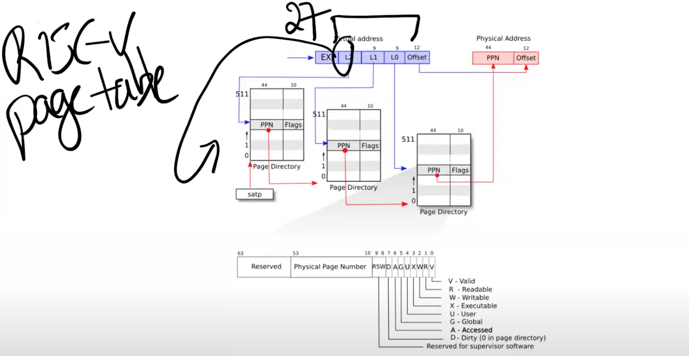

# MIT6.S081

[TOC]

## Lec01 Introduciton and Examples

### 1.7 Shell

当用C语言执行系统调用的时候，实际上函数内的指令是机器指令（汇编），在RISC-V被称为ECALL，这个指令将控制权转给内核，之后内核检查进程的内存和寄存器，并确定相应的参数。

### 1.9 exec, wait系统调用

- exec系统调用时候保留当前的文件描述符表单，在exec系统调用之前的文件描述符在新的程序中表示相同的东西
- `wait(&status)`，其中`status`等待子进程`exit`时候的返回值，而`wait`返回值是结束子进程的`pid`。如果没有子进程的话，`wait`返回-1。多个子进程就需要多个`wait`

### 1.10 I/O Redirect

```c
int main() {
    int pid;
    pid = fork();
    if (pid == 0) {
        close(1);
        open("output.txt", O_WRONLY | O_CREATE);
        char *argv[] = {"echo", "this", "is", "redirected", "echo", 0};
        exec("echo", argv);
        printf("exec failed!\n");
        exit(1);
    } else {
        wait((int *) 0);
    }
    exit(0);
}
```

注意上面第5行，子进程`close(1)`关闭了`stdout`，第6行返回值一定是1因为`open`返回当前进程**未使用的最小文件描述符序号**，于是1和`output.txt`关联，因此接下来的`echo`会输出到文件描述符1即`output.txt`中。

这体现`fork`和`exec`分离的好处，可以在执行之前修改文件描述符从而实现`redirect`。

### 管道

```c
int p[2];
pipe(p);
```

上述代码创建一个管道，并且将**读写**两个描述符记录在数组`p`中，这两个

```C
// 相当于 echo "hello world\n" | wc
int p[2];
char *argv[2];
argv[0] = "wc";
argv[1] = 0;
pipe(p);
if(fork() == 0) {
    close(0);
    dup(p[0]); // 拷贝读口并设置描述符为0取代stdin
    close(p[0]);
    close(p[1]); // 此时写口描述符都关闭了管道不再等待read
    exec("/bin/wc", argv);
} else {
    write(p[1], "hello world\n", 12);
    close(p[0]);
    close(p[1]);
}
```

注意管道会一直等待read，直到有数据（它再传递给写口）或者绑定在**写口**上的描述符都关闭了（此时read返回0即`EOF`），所以在`exec`之前必须把写口关闭，否则管道将一直等待read

## Lec03 OS Organization and System Calls

### 3.5 User/Kernel mode切换

当一个用户程序想要将程序执行的控制权交给内核，只需要执行ECALL指令并传入一个数字，这个数字代表应用程序想要调用的System Call

内核侧`syscall.c`中有一个函数`syscall`，它会检查`ECALL`参数

用户不能直接调用`fork`等函数，只能用封装好的系统调用函数执行`ECALL`指令，指令参数是代表了write系统调用的数字，控制权给了`syscall`之后，它实际调用`write`系统调用

### 3.6 宏内核 vs 微内核 （Monolithic Kernel vs Micro Kernel）

内核被称为TCB可被信任的计算空间（Trusted Computing Base）

操作系统服务都放在kernel mode中被称为Monolithic Kernel Design宏内核

- 容易出现漏洞
- 集成度高，性能好

Micro Kernel微内核，在Kernel Mode中运行尽可能少的代码，但是微内核中user/kernel mode切换通过消息性能损耗大，并且各个部分不易共享数据

### 3.7 编译运行kernel

代码分成3部分：

- kernel：所有文件被编译成一个叫做`kernel`的二进制文件，这个文件运行在kernel mode中
- user：运行在user mode的程序
- mkfs：空的文件镜像

传给QEMU的参数：

- -kernel：传递内核文件
- -m：内存数量
- -smp：可用的CPU核数
- -drive：磁盘驱动

## Lec04 Page Tables

### 4.3 页表

CPU通过MMU将VA转化成PA，页表保存在内存中，MMU从内存中读取，页表的地址保存在SATP的寄存器里。

VA分成两部分：index（27位）和offset（12位，对应4KB page中的某个字节），共39位，前25位空着。

PA：共56位，44位是物理page号（PPN），剩下12位是offset继承自VA最后12位

所以地址转换就是将27位VA index转换成44位PPN即可

实际上PageTable是多级结构，VA index实际上有3个9bit的index组成（L2, L1, L0）



每一个directory是4KB，每个条目（PTE）64bit，共512个entry，所以是用9位。SATP指向最高一级page table，然后用L2来索引最高一级page table，由此得到PPN来索引第二级（这里索引的方法是：44bit的PPN加上12bit的0，也就是**page的起始地址**，因为每个page directory都使用一个完整的page，所以直接从page起始地址开始使用就行，除了PPN之外的位可以用来存flag），在第三级的时候得到真正的PA

较重要的低5位标志位（从低到高）：

- valid
- readable
- writable
- executable
- user：可被运行在用户空间

SATP和所有page directory都存的是**物理地址**

3级page table是由硬件实现的，MMU属于硬件，但是xv中模拟了page table

### 4.4 页表缓存（Translation Lookaside Buffer）

RISCV清空TLB指令：`sfence_vma`

硬件实现

### 4.5 Kernel Page Table


主板设计者决定：在完成了虚拟到物理地址的翻译之后，如果得到的物理地址大于0x80000000会走向DRAM芯片，如果得到的物理地址低于0x80000000会走向不同的I/O设备，参考主板手册


PA中：最低下Reserved，0x100是boot，上电之后首先执行boot然后跳转到0x80000000执行。

这里还有一些其他的I/O设备：

- PLIC是中断控制器（Platform-Level Interrupt Controller）
- CLINT（Core Local Interruptor）也是中断的一部分。所以多个设备都能产生中断，需要中断控制器来将这些中断路由到合适的处理函数。
- UART0（Universal Asynchronous Receiver/Transmitter）负责与Console和显示器交互。
- VIRTIO disk，与磁盘进行交互。

为了使xv易于理解，左侧低于PHYSTOP的VA和右侧PA相同


- VA顶部有个Guard Page，对应PTE的valie为0，如果kernel stack耗尽会溢出到guard page导致page fault，但是guard page不会映射到任何物理内存。kernel stack映射两次但是只用上面一部分。VA和PA可以一对一，一对多，多对一映射等。
- 权限，kernel text用来存代码，代码可以读，可以运行，但是不能篡改，kernel data用来存数据，数据可以读写，但是不能通过数据伪装代码在kernel中运行

- free memory中放user进程的page table，text和data


user进程的虚拟地址空间分布如上图。