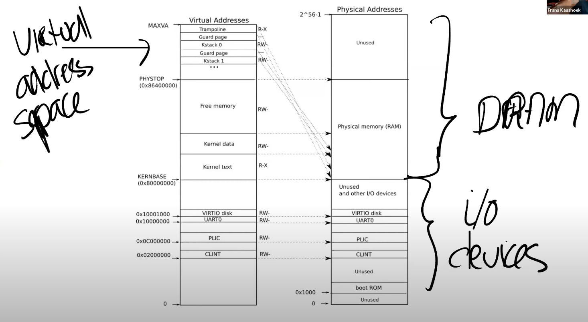
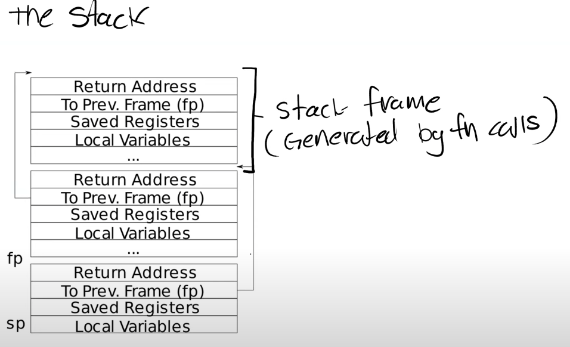
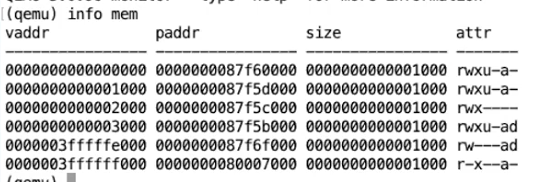

# MIT6.S081

[TOC]

## Lec01 Introduciton and Examples

### 1.7 Shell

当用C语言执行系统调用的时候，实际上函数内的指令是机器指令（汇编），在RISC-V被称为ECALL，这个指令将控制权转给内核，之后内核检查进程的内存和寄存器，并确定相应的参数。

### 1.9 exec, wait系统调用

- exec系统调用时候保留当前的文件描述符表单，在exec系统调用之前的文件描述符在新的程序中表示相同的东西
- `wait(&status)`，其中`status`等待子进程`exit`时候的返回值，而`wait`返回值是结束子进程的`pid`。如果没有子进程的话，`wait`返回-1。多个子进程就需要多个`wait`

### 1.10 I/O Redirect

```c
int main() {
    int pid;
    pid = fork();
    if (pid == 0) {
        close(1);
        open("output.txt", O_WRONLY | O_CREATE);
        char *argv[] = {"echo", "this", "is", "redirected", "echo", 0};
        exec("echo", argv);
        printf("exec failed!\n");
        exit(1);
    } else {
        wait((int *) 0);
    }
    exit(0);
}
```

注意上面第5行，子进程`close(1)`关闭了`stdout`，第6行返回值一定是1因为`open`返回当前进程**未使用的最小文件描述符序号**，于是1和`output.txt`关联，因此接下来的`echo`会输出到文件描述符1即`output.txt`中。

这体现`fork`和`exec`分离的好处，可以在执行之前修改文件描述符从而实现`redirect`。

### 管道

```c
int p[2];
pipe(p);
```

上述代码创建一个管道，并且将**读写**两个描述符记录在数组`p`中，这两个

```C
// 相当于 echo "hello world\n" | wc
int p[2];
char *argv[2];
argv[0] = "wc";
argv[1] = 0;
pipe(p);
if(fork() == 0) {
    close(0);
    dup(p[0]); // 拷贝读口并设置描述符为0取代stdin
    close(p[0]);
    close(p[1]); // 此时写口描述符都关闭了管道不再等待read
    exec("/bin/wc", argv);
} else {
    write(p[1], "hello world\n", 12);
    close(p[0]);
    close(p[1]);
}
```

注意管道会一直等待read，直到有数据（它再传递给写口）或者绑定在**写口**上的描述符都关闭了（此时read返回0即`EOF`），所以在`exec`之前必须把写口关闭，否则管道将一直等待read

## Lec03 OS Organization and System Calls

### 3.5 User/Kernel mode切换

当一个用户程序想要将程序执行的控制权交给内核，只需要执行ECALL指令并传入一个数字，这个数字代表应用程序想要调用的System Call

内核侧`syscall.c`中有一个函数`syscall`，它会检查`ECALL`参数

用户不能直接调用`fork`等函数，只能用封装好的系统调用函数执行`ECALL`指令，指令参数是代表了write系统调用的数字，控制权给了`syscall`之后，它实际调用`write`系统调用

### 3.6 宏内核 vs 微内核 （Monolithic Kernel vs Micro Kernel）

内核被称为TCB可被信任的计算空间（Trusted Computing Base）

操作系统服务都放在kernel mode中被称为Monolithic Kernel Design宏内核

- 容易出现漏洞
- 集成度高，性能好

Micro Kernel微内核，在Kernel Mode中运行尽可能少的代码，但是微内核中user/kernel mode切换通过消息性能损耗大，并且各个部分不易共享数据

### 3.7 编译运行kernel

代码分成3部分：

- kernel：所有文件被编译成一个叫做`kernel`的二进制文件，这个文件运行在kernel mode中
- user：运行在user mode的程序
- mkfs：空的文件镜像

传给QEMU的参数：

- -kernel：传递内核文件
- -m：内存数量
- -smp：可用的CPU核数
- -drive：磁盘驱动

## Lec04 Page Tables

### 4.3 页表

CPU通过MMU将VA转化成PA，页表保存在内存中，MMU从内存中读取，页表的地址保存在SATP的寄存器里。

VA分成两部分：index（27位）和offset（12位，对应4KB page中的某个字节），共39位，前25位空着。

PA：共56位，44位是物理page号（PPN），剩下12位是offset继承自VA最后12位

所以地址转换就是将27位VA index转换成44位PPN即可

实际上PageTable是多级结构，VA index实际上有3个9bit的index组成（L2, L1, L0）


每一个directory是4KB，每个条目（PTE）64bit，共512个entry，所以是用9位。SATP指向最高一级page table，然后用L2来索引最高一级page table，由此得到PPN来索引第二级（这里索引的方法是：44bit的PPN加上12bit的0，也就是**page的起始地址**，因为每个page directory都使用一个完整的page，所以直接从page起始地址开始使用就行，除了PPN之外的位可以用来存flag），在第三级的时候得到真正的PA

较重要的低5位标志位（从低到高）：

- valid
- readable
- writable
- executable
- user：可被运行在用户空间

SATP和所有page directory都存的是**物理地址**

3级page table是由硬件实现的，MMU属于硬件，但是xv中模拟了page table

### 4.4 页表缓存（Translation Lookaside Buffer）

RISCV清空TLB指令：`sfence_vma`

硬件实现

### 4.5 Kernel Page Table



主板设计者决定：在完成了虚拟到物理地址的翻译之后，如果得到的物理地址大于0x80000000会走向DRAM芯片，如果得到的物理地址低于0x80000000会走向不同的I/O设备，参考主板手册


PA中：最低下Reserved，0x100是boot，上电之后首先执行boot然后跳转到0x80000000执行。

这里还有一些其他的I/O设备：

- PLIC是中断控制器（Platform-Level Interrupt Controller）
- CLINT（Core Local Interruptor）也是中断的一部分。所以多个设备都能产生中断，需要中断控制器来将这些中断路由到合适的处理函数。
- UART0（Universal Asynchronous Receiver/Transmitter）负责与Console和显示器交互。
- VIRTIO disk，与磁盘进行交互。

为了使xv易于理解，左侧低于PHYSTOP的VA和右侧PA相同


- VA顶部有个Guard Page，对应PTE的valie为0，如果kernel stack耗尽会溢出到guard page导致page fault，但是guard page不会映射到任何物理内存。kernel stack映射两次但是只用上面一部分。VA和PA可以一对一，一对多，多对一映射等。
- 权限，kernel text用来存代码，代码可以读，可以运行，但是不能篡改，kernel data用来存数据，数据可以读写，但是不能通过数据伪装代码在kernel中运行

- free memory中放user进程的page table，text和data


user进程的虚拟地址空间分布如上图。

## Lec05 Calling conventions and stack frames RISC-V

### 5.3 gdb和汇编代码执行

`.global <function_name>`表示后者是全局函数，其他文件中也可以调用这个函数

`.asm` 和`.s`的区别在于前者有大量额外的标注，通常编译之后是`.s`文件

gdb中输入`tui enable`可以打开源代码战士窗口

`layout asm`看到所有的汇编指令，`layout reg`看到所有寄存器信息，`layout  source`查看源代码，`layout split`同时查看源代码和汇编

`focus reg/asm`可以设置focus到某个窗口

### 5.5 Stack



sp指向Stack的底部，fp指向Stack的顶部

查看调用栈`info/i frame`

查看一个数组`p *<addr>@<len>`

watch一个变量：`watch <variable>`，然后用`i locals`可以看到，设置conditional break：`b <position> if <condition>`

## Lec06 Isolation & system call entry/exit

### 6.1 Trap机制

trap流程：

- 保护32个用户寄存器
- 保护PC
- mode改成supervisor mode
- SATP指向kernel page table
- 堆栈寄存器指向内核的一个地址
- 跳入内核代码

supervisor mode能做的事情：

- 读写控制寄存器
- 使用PTE_U标志位0的PTE

注意supervisor不能读写任意物理地址，也需要通过page table来访问内存，如果kernel page table中不包含该VA或者这个地址PTE_U=1那么也不能访问。

### 6.2 Trap代码执行流程

write系统调用的过程：

- write执行ECALL指令切换到内核
- 内核执行汇编函数`uservec`（`trampoline.s`）
- 跳转到C语言函数`usertrap`（`trap.c`）
- 在上面这个函数中执行`syscall`，根据传入的代表系统调用的数字实现对应的syscall，在这里是`sys_write`
- `sys_write`将数据显示到console上然后结束之后返回`syscall`
- `syscall`调用`usertrapret`（`trap.c`）完成部分返回给用户空间的工作
- 执行汇编函数`userret`（`trampoline.s`）调用机器指令返回用户空间，恢复ECALL之后的程序执行

### 6.3 ECALL指令之前的状态

QEMU中有一个方法可以打印当前的page table。从QEMU界面，输入`ctrl a + c`可以进入到QEMU的console，之后输入`info mem`，QEMU会打印完整的page table。



这是个非常小的page table，它只包含了6条映射关系。这是用户程序Shell的page table，而Shell是一个非常小的程序，这6条映射关系是有关Shell的指令和数据，以及一个无效的page用来作为guard page，以防止Shell尝试使用过多的stack page。我们可以看出这个page是无效的，因为在attr这一列它并没有设置u标志位（第三行）。attr这一列是PTE的标志位，第三行的标志位是rwx表明这个page可以读，可以写，也可以执行指令。之后的是u标志位，它表明PTE_u标志位是否被设置，用户代码只能访问u标志位设置了的PTE。再下一个标志位我也不记得是什么了（注，从4.3可以看出，这个标志位是Global）。再下一个标志位是a（Accessed），表明这条PTE是不是被使用过。再下一个标志位d（Dirty）表明这条PTE是不是被写过。

最后两条PTE的虚拟地址非常大，非常接近虚拟地址的顶端，分别是trapframe page和trampoline page。你可以看到，它们都没有设置u标志，所以用户代码不能访问这两条PTE。一旦我们进入到了supervisor mode，我们就可以访问这两条PTE了。

对于这里page table，有一件事情需要注意：它并没有包含任何内核部分的地址映射，这里既没有对于kernel data的映射，也没有对于kernel指令的映射。除了最后两条PTE，这个page table几乎是完全为用户代码执行而创建，所以它对于在内核执行代码并没有直接特殊的作用。

### 6.4 ECALL指令之后的状态

ECALL执行三件事：

- user mode变成supervisor mode
- 将`PC`保存在`SEPC`中
- ecall跳转到`STVEC`指向的指令，`PC`设置为`STVEC`，在此即`trampoline page`

ECALL之后来到`trampoline page`（trampoline：**蹦床**），首先执行第一个函数`uservec`，`csrrw a0, sscratch, a0`将`a0`和`sscratch`交换，之后内核可以任意使用`a0`。

page table还没有变，依旧使用user page table，这意味着trap处理代码（`trampoline page`）必须存在于每一个user page table，内核将`trampoline page`映射给了所有user page table。

接下来：

- 我们需要保存32个用户寄存器的内容，这样当我们想要恢复用户代码执行时，我们才能恢复这些寄存器的内容。

- 因为现在我们还在user page table，我们需要切换到kernel page table。

- 我们需要创建或者找到一个kernel stack，并将Stack Pointer寄存器的内容指向那个kernel stack。这样才能给C代码提供栈。

- 我们还需要跳转到内核中C代码的某些合理的位置。

### 6.5 uservec函数

来到`trampoline page`直接执行第一个函数`uservec`，首先需要保护32个寄存器。supervisor mode不能直接访问物理内存，只能用user page table中的非user页（因为此时还没有更改`SATP`，因为我们此时还不知道kernel page table的位置，另外还因为我们还需要同一个空闲寄存器来暂存kernel page table的地址，而我们还没保护好寄存器），XV6给每个user page table中映射了一个非user页`trapframe page`（地址永远为`0x3ffffffe000`来存某些数据，包括32个寄存器）。

> 问题：为何不保存在user的stack里（用户内存），而放在trapframe page（内核内存）里？
>
> 答：因为有些编程语言没有栈或者stack pointer不指向任何地址或者栈格式奇怪等。

内核最早进入user space的时候将`trapframe page`地址放在了`sscratch`里，所以`trampoline.S`代码中可以看到将所有寄存器保存到了`trapframe page`里。


> 问题：内核在哪里设置`sscratch`？
>
> 答：第一次内核返回user space的时候（一开始就运行在supervisor，然后第一次回到user时），
>
> - 执行`trap.c`中的`fn`函数，该函数返回值为`TRAPFRAME`和user page table，而函数第一个返回值放在`a0`里
> - 执行`trampoline.S`的`userret`函数，将`a0`和`sscratch`交换，此时`sscratch`就是`TRAPFRAME`了

保护完寄存器，接下来：

- 将kernel stack放在sp中
- 将cpu核编号`hartid`放到tp中
- 将函数`usertrap`指针写入t0
- 将kernel page table写入t1（严格来说并不是kernel page table的地址，这是你需要向SATP寄存器写入的数据。它包含了kernel page table的地址，但是移位了），然后交换`SATP`和t1
  - 此时程序没有崩溃的原因：trampoline page在user page table和kernel page table都有相同的映射关系
- `jr t0`跳转到t0所在的函数即`usertrap`

### 6.6 usertrap函数

进入usertrap的情况：系统调用，运算时除以0，使用了一个未被映射的虚拟地址，或者是设备中断。

usertrap某种程度上存储并恢复硬件状态，但是它也需要检查触发trap的原因，以确定相应的处理方式。

流程：

- 设置`STVEC`为`kernelvec`，此为内核trap处理代码位置
- `myproc`函数从当前CPU核上的进程数组中获得当前进程，使用之前的tp寄存器（hartid）
- 保存user的PC到当前进程的trapframe中（因为接下来可能运行别的进程）

- 根据trap的原因RISC-V的SCAUSE寄存器会保存不同的值，8代表系统调用
  - 首先检查当前进程是否被其他进程杀掉
  - 调整sepc，使之+4，之后返回时跳过ecall
  - `intr_on`打开中断：XV6会在处理系统调用的时候使能中断，这样中断可以更快的服务，有些系统调用需要许多时间处理
  - 最后调用`syscall`函数（`syscall.c`），通过编号（放在a7中）查找对应syscall服务调用，注意：返回值重新放回trapframe的a0里
- 再次检查当前进程是否被kill
- 调用`usertrapret`

### 6.7 usertrapret函数

流程：

- 关闭中断。目的：将要更新`STVEC`来指向用户空间的trap处理代码，如果不关闭的话，出现中断就会跳到user trap process code发生错误
- 设置STVEC指向trampoline代码。注意`trampoline`最后`sret`会重新打开中断（利用SSTATUS寄存器）
- 填入trapframe
  - 存储kernel page table指针
  - 存储kernel stack
  - 存储`usertrap`函数地址（6.5中才能写入t0）
  - 从tp中读取CPU核编号放到trapframe中

- 设置SSTATUS寄存器，清除SPP位（即变为user mode），置中断位（允许中断）
- 设置sepc为之前保存的user pc值
- 设置SATP为user的page table
- `uint64 fn = TRAMPOLINE + (userret - trampoline)`用来计算跳转到汇编代码的位置（`trampoline.S`中`userret`函数的位置）
- 最后`((void(*)(uint64, uint64))fn)(TRAPFRAME, satp)`，将fn指针作为一个函数指针，执行相应的函数（也就是userret函数）并传入两个参数，两个参数存储在a0，a1寄存器中，即a0存trapframe，a1存satp。

### 6.8 userret函数

程序回到trampoline。流程：

- 切换SATP，`csrw satp, a1`
- `sfence.vma`，page table切换成user page table
- `ld t0, 112(a0); csrw sscratch, t0`，将系统调用的返回值放到`sscratch`中
- 恢复寄存器（除了a0，它还是trapframe的地址）
- 交换sscratch和a0，此时a0是系统调用返回值，sscratch是trapframe的地址
- sret
  - 程序切换成user mode
  - sepc拷贝到pc
  - 重新打开中断

## Lec08 Page faults

### 8.1 Page Fault Basics

出现错误的地址，xv会打印错误的虚拟地址并保存在`STVAL`中。所以当用户触发page fault，会使用trap机制运行切换到内核然后将出错地址放在`STVAL`寄存器中

出错的原因放在`SCAUSE`里，比如，13表示是因为load引起的page fault；15表示是因为store引起的page fault；12表示是因为指令执行引起的page fault。


触发page fault的指令的地址放在`SEPC`，也在`trapframe->epc`中

### 8.2 Lazy page allocation

`sbrk`增加或减少内存，单位是字节数

lazy page allocation：

- 调用增加内存的`sbrk`的时候，只将`p->sz`增加`n`，内核并不分配任何物理内存
- 在某个时间点需要使用新申请的那部分内存就触发page fault，会分配内存page并重新执行指令（如果page fault的虚拟地址小于当前`p->sz`，同时大于`stack`那么就是未分配内存）

在xv中page fault如果Out Of Memory就会直接杀死进程

`trap.c`的`usertrap`函数进行修改：

```c
...;
else if (r_scause() == 15) {
    uint64 va = r_stval();
    printf("page fault %p\n", va);
    uint64 ka = (uint64)kalloc();
    if (ka == 0) p->killed = 1;
    else {
        memset((void*)ka, 0, PGSIZE);
        va = PGROUNDDOWN(va);
        if (mappages(p->pagetable, va, PGSIZE, ka, PTE_W|PTE_U|PTE_R) != 0) {
            kfree((void*)ka);
            p->killed = 1;
        }
    }
}

...;
```

`uvmunmap`修改：

```c
for (a = va; a < va + npages * PGSIZE; a += PGSIZE) {
    if ((*pte & PTE_V) == 0)
        continue; // 原来是发生panic
    ...;
}
```

修改的原因是：lazy page allocation里有些内存并没有分配，`unmap`发生page fault，我们实际上应该直接忽略掉

### 8.3 Zero Fill On Demand

BSS区域包含了未被初始化或者初始化为0的全局变量，这里有很多page且内容都是0。

优化方法：将多个全是0的page映射成一个page。这个page是只读的，发生page fault的时候新建一个page重新执行命令

好处：

- lazy allocation节省内存
- exec需要的工作变少

坏处：

- page fault代价高，因为要转到内核，保存寄存器等工作（远大于store）

### 8.4 Copy On Write Fork

`fork`之后子进程创建一个Shell地址空间的完整拷贝，`exec`会直接丢弃这个空间，所以很浪费

子进程可以直接共享父进程的物理内存page，将这些page设置成只读，当某个进程要写入page的时候就将这个page复制成一个可写的page，父进程对应的page可以变成可读写。

如何检测是copy-on-write readable而不是普通的readable，前者可以用PTE第8个标志位来标示（第8到10位是reserved的RSW位）

需要检测物理页的引用计数，当为0的时候才能释放

### 8.5 Demand Paging

`exec`会将`text/data`以eager加载到page table中，我们也选择lazy模式

需要解决的问题：

- OOM之后的策略
  - evict撤回、替换，采用LRU策略，优先选择non-dirty替换（不选择dirty的原因，因为OOM之后的写回是暂时的，等一会要再重新恢复到内存里，然后因为dirty又得被写回一次，所以产生了浪费）
  - PTE的bit7用作dirty bit，bit6用作access bit（LRU策略）

### 8.6 Memory Mapped Files

核心思想：将完整或者部分文件加载到内存中

```c
mmap(va, len, protection, flags, fd, offset);
```

上述语义为：从文件描述符对应的文件偏移量的位置开始，映射长度为len的内容到虚拟地址va，同时加上保护如只读或读写

如果内核使用eager方法实现`mmap`，那么当`unmap`的时候需要将dirty block写回到文件中

在lazy模式下，不会立刻将文件内容拷贝到内存中，而是先记录这个PTE属于这个描述符，通常记录在VMA结构体（Virtual Memory Area）

多个进程同时将文件映射到内存，如果没有文件锁定，会产生unknown behavior

## Lec09 Interrupts

### 9.1 真实操作系统内存使用情况

大部分内存都被使用了，并且RES内存（实际使用的物理内存）远小于VIRT内存（使用到的虚拟内存）。

### 9.2 Interrupt硬件部分

- asynchronous，中断处理程序和当前进程没有任何关联
- concurrency，CPU和产生中断的设备是并发执行的
- program device，外部设备（如网卡）的编程

主板上不同的设备映射到内核内存某处，读写内存可以向对应设备执行load/store指令

CPU通过PLIC（Platform Level Interrupt Control）来处理中断，将中断路由到某一个CPU核，如果所有CPU核都在处理中断那么就保留中断直到有一个CPU核来处理

流程：

- PLIC通知当前有待处理的中断
- 其中一个CPU核Claim接受中断
- CPU处理完中断通知PLIC
- PLIC不再保留中断信息

### 9.3 设备驱动概述

管理设备的代码叫做驱动，驱动都在内核里

驱动大部分分成两个部分：

- bottom：通常是中断处理程序。存在限制，没有运行在任何进程的context中，进程的page table不知道从哪个地址读写数据，因此不能直接从interrupt handler读写数据
- top：用户进程或者是内核的其他部分调用接口（对于UART来说是read/write接口，这些接口可以被更高级的代码调用），处理用户进程交互并进行数据读写

### 9.4 在XV6中设置中断

console显示`$`：设备将字符传给UART，UART发送完之后产生中断，在QEMU中模拟线路另一段有另一个UART芯片（模拟）这个芯片连接了虚拟的Console，它进一步显示`$`在Console上。

用户输入`ls`显示在桌面上：键盘连接到了UART的输入线路，按键字符通过串口线发送到另一端的UART芯片，另一端的UART芯片先将数据bit合成byte然后产生中断告诉CPU，CPU通过Interrupt handler来处理这个字符

中断相关的寄存器：

- SIE（Supervisor Interrupt Enable），分别有bit处理 例如UART的外部设备的中断E、软件中断S和定时器中断T
- SSTATUS，有一个bit来打开和关闭中断，控制所有中断
- SIP，发生中断时查看得知中断类型
- SCAUSE，表明原因是中断
- STVEC，保存发生trap/page fault/中断时CPU的PC

代码：

- `start.c`的`start`函数将所有的中断都设置在Supervisor mode，然后设置SIE寄存器来接收External，软件和定时器中断，之后初始化定时器。
- `main.c`的`main`函数第一个外设是`console`
  - `console.c`中的`consoleinit`函数调用`uartinit`
  - `uart.c`的`uartinit`函数先关闭中断，之后设置波特率（串口线的传输速度），设置字符长度为8bit，重置FIFO，最后再重新打开中断。此时`uart`可以生成中断，但是PLIC还不能接收中断并路由
- `main`函数调用`plicinit`
  - PLIC占用I/O地址为`0xC000_0000`，设置`uart`中断使能，这里略
- `main`调用`plicinithart`，每个CPU核都调用`plicinithart`函数表明对于哪些外设中断感兴趣
- CPU还没有设置好接收中断，因为还没有设置`scause`寄存器，所以在`main`函数最后调用`scheduler`函数，该函数主要是运行进程，但是在运行之前会执行`intr_on`函数来使得CPU能接受中断
  - `intr_on`函数只完成一件事就是设置`sstatus`寄存器打开中断标志位

### 9.5 UART驱动的top部分

例如：console显示`$`和一个空格

- `user/init.c`的`main`函数（`init`是系统启动之后的第一个进程）

  - ```c
    if (open("console", O_RDWR) < 0) {
        mknod("console", CONSOLE, 0);
        open("console", O_RDWR);
    }
    dup(0); // stdout
    dup(0); // stderr
    ```

  - 通过`mknod`操作创建console设备，文件描述符为0（第一个文件），`dup`赋值文件描述符得到另外两个文件描述符1和2，最终都用来表示Console（我们自己的OS来规定这0/1/2对应是stdin/stdout/stderr）

  - ```c
    for (;;) {
        pid = fork();
        if (pid < 0) exit(1);
        if (pid == 0) {
            exec("sh", argv);
            exit(1);
        }
        ...; // 父进程会在此等待子进程结束
    }
    ```

  - 在每个console中执行`sh`程序

- `user/sh.c`中`getcmd`函数`fprintf(2, "$ ")`，向console这个“文件”输入了后面的字符串
- 在`printf.c`中实际上系统调用了`write(fd, &c, 1)`
- 进入`sysfile.c`的`sys_write`函数，调用`kernel/file.c`的`filewrite`函数
- 在`filewrite`函数中判断文件描述符的类型，`mknod`生成的文件描述符为设备`FD_DEVICE`，我们对特定的设备执行响应的`write`函数，目前是`Console`，于是调用`kernel/console.c`中`consolewrite`函数
- `consolewrite`函数通过`either_copyin`将字符拷入，然后调用`uartputc`函数，故`consolewrite`就是UART驱动的top部分
- `uart.c`中的`uartputc`会实际打印字符
  - 其中维护了一个32bytes的环形队列buffer
  - 若buffer为满会sleep一段时间，不满则调用`uartstart`函数
- `uartstart`函数就是通知设备执行操作
  - 首先判断当前设置是否为空闲，若空闲则从buffer中读出数据然后写入THR（Transmission Holding Rigster）发送寄存器，接下来系统调用返回
  - 与此同时，UART设备将数据送出，在某个时间点我们会收到UART中断

### 9.6 UART驱动的bottom部分

在我们向Console输出字符时发生中断会产生什么情况（因为`SSTATUS`打开了UART中断）？

我的理解：相当于利用中断来不断循环发送UART sender buffer里的字符

假设键盘生成了一个中断并且发送给PLIC，然后PLIC路由给一个特定的CPU核，如果这个核设置了SIE寄存器的E bit（外部中断），那么发生以下事情：

- 清除SIE寄存器相应的bit，阻止CPU核被其他中断打扰，处理完之后再恢复
- 设置`SEPC`为当前的`PC`
- 保存当前的mode，即`user mode`
- 设置mode为`supervisor mode`

- 将PC设置为`STVEC`（trap处理程序的地址），shell运行在用户空间，所以`STVEC`保存的是`uservec`函数地址，该函数调用`usertrap`
- 在`trap.c`的`usertrap`函数里处理中断，调用`devintr`函数得到当前的中断类型
  - `devintr`函数通过`SCAUSE`寄存器判断当前的中断是否来自外部中断，然后调用`plic_claim`函数来获取中断
  - `plic_cliam`在`plic.c`文件中，这个函数里，返回当前CPU核得到的中断号（从PLIC获得到的）
  - `devintr`函数判断如果是`UART`中断，那就调用`uartintr`函数
  - `uart.c`中的`uartintr`函数会先read一下收到的数据（但是目前console并没有收到输入，即没有键盘的输入，所以执行无效），然后运行`uartstart`函数
  - `uartstart`函数会将存储在buffer中的任意字符发出，此时会把空格再发送过去（write系统调用并发地将空格字符写入buffer中）

### 9.7 Interrupt相关的并发

- 设备与CPU并行运行
  - producur/consumer并发
- 中断会停止当前运行的程序：恢复用户空间相对简单，但是内核被中断打断就比较麻烦，如果不能被打断，需要临时关闭中断，来确保代码原子性
- 驱动的top和bottom是并行运行的：使用lock来共享数据

### 9.8 UART读取键盘输入

在UART另一侧会发生类似的事情，Shell可能会调用read从键盘中读取字符。

- read系统调用的底层会调用`fileread`函数。这个函数里会根据读取文件类型调用相应的read函数，在我们的例子中就是调用`console.c`中的`consoleread`函数
- `consoleread`也有一个buffer，128bytes，为consumer
- 若用户键盘输入了字符，这个字符发送到主板的UART芯片，产生中断再被PLIC路由到某个CPU核，之后触发`devintr`函数，该函数发现是一个UART中断，通过`uartgetc`获得字符，然后传递给`consoleintr`函数
- 默认情况是字符通过`consputc`输出到console上。之后字符放在buffer里，当遇到换行的时候，唤醒之前sleep的进程也就是shell，再从buffer中将数据读出

consumer和producer之间也是互相等待

## Lec10 Multiprocessors and locking

### 10.2 锁如何避免race condition？

`acquire`和`release`之间的指令是critical section

### 10.3 什么时候使用锁？

简单的规则：如果两个进程访问了一个共享的数据结构，并且其中一个进程会更新共享的数据结构

实际上有些情况下不加锁也可以正常工作，称为lock-free program，比较复杂这里不考虑

锁有时需要和操作关联，而不是数据关联（我的理解：转账的过程加锁，而不是先对某一方的账户加锁扣钱解锁，然后对另一方加锁加钱解锁）

### 10.4 锁的特性和死锁

锁的作用：

- 避免丢失更新
- 打包多个操作使之具有原子性
- 锁可以维护共享数据结构的不变性

死锁：先acquire一个锁，在critical section里再acquire同一个锁

如果多次acquire一个锁会触发panic

但是如果有两个CPU互相获得对方等待的锁就会产生deadly embrace，死锁就不容易探测了

解决方案：多个锁时需要先排序然后操作需要以相同的顺序获取锁

但是在设计操作系统的时候，如果一个模块m1的方法g要调用另一个模块m2的方法f，那么m2的锁必须要对m1可见来进行排序，导致违背了代码抽象的原则

在XV6中有多种锁的排序，如果不在同一个操作中被acquire就不需要排序

### 10.5 锁与性能

通常的开发流程：

- 先以coarse-graine lock（大锁）开始
- 再对程序测试看是否能够使用多核
- 如果不可以就需要重构程序（不必要就不要重构）

### 10.6 XV6中UART模块对于锁的使用

UART采用消费者-生产者模式。锁保护UART的传输缓存；当传输数据时，写指针会指向传输缓存的下一个空闲槽位；而读指针指向的是下一个需要被传输的槽位。

```c
struct spinlock uart_tx_lock;
#define UART_TX_BUF_SIZE 32
char uart_tx_buf[UART_TX_BUF_SIZE];
int uart_tx_w;
int uart_tx_r;
```

`uartputc`函数：首先获得锁，然后检查是否有空槽位，如果有就放到空槽位；写指针加一；调用uartstart；最后释放锁。如果两个进程同时调用`uartputc`能确保两个进程按顺序进入两个空槽

`uartstart`检查缓存不为空就需要处理缓存中的一些字符。锁确保一个时间内只有一个CPU的进程可以写入UART的寄存器THR

因为UART中断（里面有`uartstart`）可能和printf并行执行（各在一个CPU上），所以中断处理程序也需要给`uartstart`加锁

### 10.7 自旋锁（Spin lock）的实现（一）

`acquire`中有个死循环，判断锁对象的locked字段是否为0，如果为0表示没有持有者就可以获取锁，然后设置locked字段为1，返回

但是有问题：两个进程同时读到锁的locked字段为0

常见的解决方法：`amoswap`指令，保证一次test-and-set操作的原子性。这个指令接收3个参数，分别是address，寄存器r1，寄存器r2。这条指令会先锁定住address，将address中的数据保存在一个临时变量中（tmp），之后将r1中的数据写入到地址中，之后再将保存在临时变量中的数据写入到r2中，最后再对于地址解锁。

C语言标准库定义了原子操作，`__sync_lock_test_and_set`。代码是`while (__sync_lock_test_and_set(&lk->locked, 1) != 0)`，逻辑是一直用1和locked的交换并返回locked里原来的数值，只有locked原来是0才能结束循环。

`__sync_lock_release`函数底层也是`awoswap`指令，目的是为了防止同时有进程向locked的字段写入1或0（store指令可能包含两个微指令）

注意：acquire函数一开始会**关闭中断**，如果没有关闭中断有可能中断中又acquire同一把锁（例如`uartputc`里acquire了锁，完成传输之后产生中断又acquire同一把锁）。所以spin lock要处理两类并发，一类是CPU之间的并发，一类是CPU中断和普通程序之间的并发。

注意2：编译器可能会在不改变执行结果的提前下改变指令顺序，导致并发出现问题。为了禁止这种情况，需要使用memory fence或者synchronize指令，对于`_sync_synchronize`指令，任何load/store指令都不能移动到它之后。下面是`release`关于synchronize的注释：

> Tell the C compiler and the CPU to not move loads or stores past this point, to ensure that all the stores in the critical section are visible to other CPUs before the lock is released, and that locks in the critical section occur strictly before the lock is released.

简单说就是`release`设置`locked=0`之前所有critical section的load和store指令都要执行完了。
